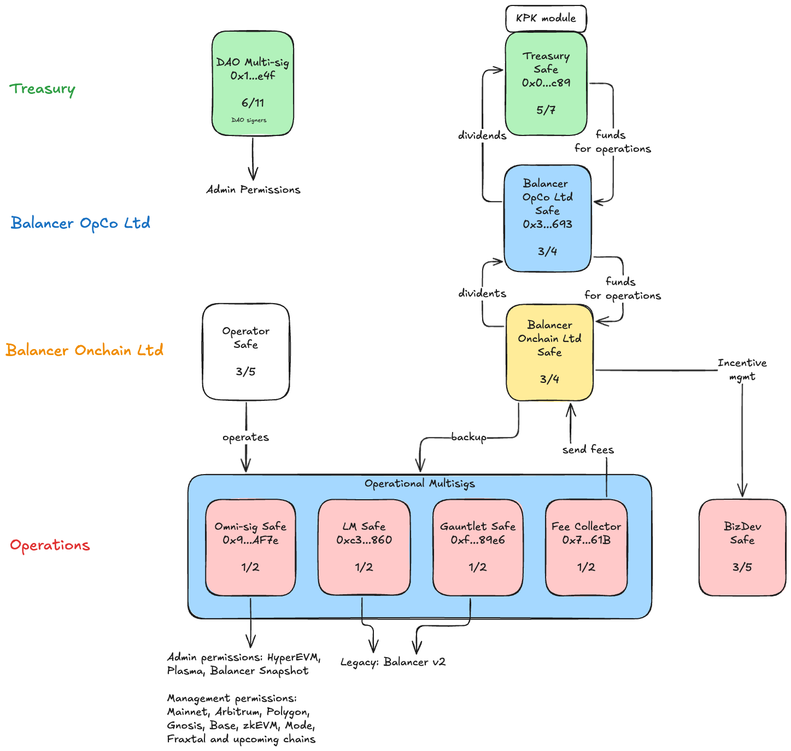

# Corporate Structure

## Overview

As of [BIP-882](https://forum.balancer.fi/t/bip-882-transitioning-onchain-operations-of-the-balancer-dao-to-balancer-onchain-limited/6859), the Balancer ecosystem operates through a formal corporate structure that provides legal clarity, operational efficiency, and proper risk management while maintaining alignment with decentralized governance.

This corporate structure is mirrored on-chain through a hierarchical safe system, where each legal entity is represented by a corresponding Safe multisig. This ensures that the off-chain legal responsibilities and on-chain operational capabilities are aligned.

This structure was established following [BIP-863](https://forum.balancer.fi/t/bip-863-incorporation-of-a-legal-structure-for-balancer-treasury-and-finance-operations/6623), which approved the incorporation of a legal structure for Balancer treasury and finance operations.

## Corporate Hierarchy and On-Chain Representation

The following diagram illustrates how the corporate structure is reflected on-chain through the hierarchical safe system:

Each legal entity in the corporate hierarchy has a corresponding Safe that serves as its on-chain representation, enabling the entity to hold assets, execute transactions, and fulfill its operational mandate.

### Balancer Foundation

The Balancer Foundation serves as the ultimate custodian of the Balancer ecosystem's interests.

**Responsibilities:**
- Owns and oversees Balancer OpCo Limited
- Receives dividends from Balancer OpCo Limited
- Holds ecosystem reserves

**On-Chain Representation:** Treasury Safe

**Safe Address:** [0x0EFcCBb9E2C09Ea29551879bd9Da32362b32fc89](https://app.safe.global/home?safe=eth:0x0EFcCBb9E2C09Ea29551879bd9Da32362b32fc89)

**Controlled By:** Foundation Board of Directors on behalf of the Balancer DAO

### Balancer OpCo Limited

Balancer OpCo Limited is a wholly-owned subsidiary of the Balancer Foundation.

**Responsibilities:**
- Receives grants for operational funding
- Distributes dividends to the Balancer Foundation (Treasury Safe)
- Owns Balancer Onchain Limited

**On-Chain Representation:** Balancer OpCo Ltd Safe

**Safe Address:** [0x3B8910F378034FD6E103Df958863e5c684072693](https://app.safe.global/home?safe=eth:0x3B8910F378034FD6E103Df958863e5c684072693)

**Controlled By:** Foundation Directors (3/4 threshold)

### Balancer Onchain Limited

Balancer Onchain Limited is a BVI company wholly owned by Balancer OpCo Limited. It serves as the central hub for all on-chain operations.

**Responsibilities:**
- Collect and distribute protocol-generated fees
- Manage and execute token reward distributions
- Implement governance proposals by executing payloads
- Distribute revenue to Balancer OpCo Limited via dividends
- Subcontract or perform other operations as designated by its Directors, the Balancer Foundation board, or DAO Governance

**On-Chain Representation:** Balancer Onchain Ltd Safe

**Safe Address:** [0x16b0056636Fcc85f92C49cD49a24bc519d4A1941](https://app.safe.global/home?safe=eth:0x16b0056636Fcc85f92C49cD49a24bc519d4A1941)

**Controlled By:** Foundation Directors (3/4 threshold)

### DAO Multi-sig

The DAO Multi-sig maintains DAO administrative permissions and represents the broader Balancer community governance.

**Responsibilities:**
- DAO administrative permissions
- Funding BIPs
- Gauge killing
- veBAL allowlisting

**Safe Address:** [0x10A19e7eE7d7F8a52822f6817de8ea18204F2e4f](https://app.safe.global/home?safe=eth:0x10A19e7eE7d7F8a52822f6817de8ea18204F2e4f)

**Controlled By:** DAO Signers (6/11 threshold)

## Operational Safes

Beyond the corporate entity safes, several operational safes exist to manage specific functions:

### BizDev Safe

Manages third-party incentives and partnership funds.

**Safe Address:** [0xF3B4829C8B9E2910C2396538F49a12b0c2475a7e](https://app.safe.global/home?safe=eth:0xF3B4829C8B9E2910C2396538F49a12b0c2475a7e)

**Controlled By:** BizDev Team (3/5 threshold)

### Operator Safe

Executes day-to-day on-chain operations through third-party service provider [MAXYZ](https://forum.balancer.fi/t/maxyz-flawless-onchain-execution/6851).

**Safe Address:** [0xBeF27037bC6311b96635E5e9Af3A73EBF6Ca8878](https://app.safe.global/home?safe=eth:0xBeF27037bC6311b96635E5e9Af3A73EBF6Ca8878) (deployed on all networks where Balancer contracts are in use)

**Controlled By:** MAXYZ Operator (3/5 threshold)

::: info Operator Exchangeability
The Operator can be exchanged for another service provider if needed. Balancer Onchain Ltd Safe maintains control over the operational multisigs and can replace the operator through the 1/2 threshold configuration.
:::

### Operational Multisig Configuration

All operational multisigs (fee collection, liquidity mining, gauge management) use a standardized **1/2 threshold** configuration with:

- Balancer Onchain Ltd Safe
- Operator Safe

This ensures efficient execution with proper oversight—Balancer Onchain Limited maintains control while delegating execution to the Operator, and either party can execute necessary operations.

## Treasury Council

The Treasury Council was established by BIP-882 to ensure ecosystem interests are protected. It deprecates and replaces the previous Ecosystem Council (from [BIP-658](https://forum.balancer.fi/t/bip-658-ecosystem-council-review-and-self-insurance-cover/5856)).

### Authority

The Treasury Council has the authority to:

- Object to any Corporate Resolutions or activities not deemed in the ecosystem's best interests
- Oversee distributions, liquidations, or other material actions proposed by Directors
- Ensure alignment with Balancer governance resolutions
- Administer the self-insurance fund

### Members

| Member | Address |
|--------|---------|
| 0xDanko | `0x122AFb4667C5f80e45721a42C7c81e9140C62FA4` |
| Xeonus | `0xaa5af0dd9c52c773d36cdbc509a0b2a1ded4c196` |
| danielmk | `0x606681E47afC7869482660eCD61bd45B53523D83` |
| mendesfabio | `0x90347b9CC81a4a28aAc74E8B134040d5ce2eaB6D` |
| solarcurve | `0x512fce9B07Ce64590849115EE6B32fd40eC0f5F3` |
| gosuto | `0x11e450c72c2258ec792d5f64a263ecb18e8c0f06` |
| notsoformal | `0xd17a9f089862351af82fa782435fac0f9e17786c` |

The Treasury Council controls the Treasury Safe with a **5/7 threshold**.

## Self-Insurance Fund

Through previous governance resolutions ([BIP-14](https://forum.balancer.fi/t/bip-14-funding-proposal-for-the-balancer-foundation/3316), [BIP-198](https://forum.balancer.fi/t/bip-198-creation-of-ecosystem-council-and-amended-self-insurance-fund/4409), [BIP-658](https://forum.balancer.fi/t/bip-658-ecosystem-council-review-and-self-insurance-cover/5856)), a self-insurance fund of $1,250,000 USD was established (held in the Treasury Safe in BAL tokens).

### Coverage

BIP-882 ratified the expansion of this fund's scope to protect:

- Balancer Labs
- Balancer Foundation
- Balancer OpCo Limited
- Balancer Onchain Limited
- Underlying service providers

### Disbursement Requirements

Disbursements from the self-insurance fund require:

1. Verification by independent legal counsel
2. Confirmation that costs are directly related to Balancer work
3. Confirmation that costs are not eligible under other insurance coverage
4. Direct movement from the Treasury Safe to recipients through Balancer Foundation

## Emergency Procedures

- The Treasury Council maintains override capability on critical infrastructure
- The self-insurance fund remains available for unforeseen complications
- Balancer Onchain Ltd Safe can intervene in emergency situations or swap out the operator if needed
- The [Emergency subDAO](./emergency.md) retains bounded authority for protocol protection

## References

- [BIP-882: Transitioning Onchain Operations to Balancer Onchain Limited](https://forum.balancer.fi/t/bip-882-transitioning-onchain-operations-of-the-balancer-dao-to-balancer-onchain-limited/6859)
- [BIP-863: Legal Structure for Onchain Operations](https://forum.balancer.fi/t/bip-863-incorporation-of-a-legal-structure-for-balancer-treasury-and-finance-operations/6623)
- [BIP-873: Balancer Ecosystem Roadmap Proposal and Funding](https://forum.balancer.fi/t/bip-873-balancer-ecosystem-roadmap-proposal-and-funding/6668)
