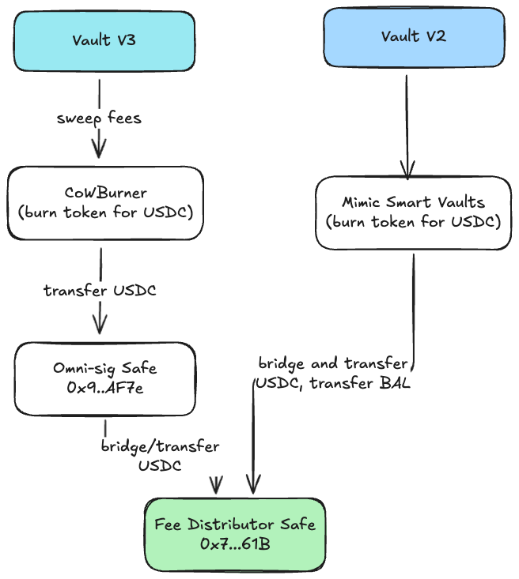
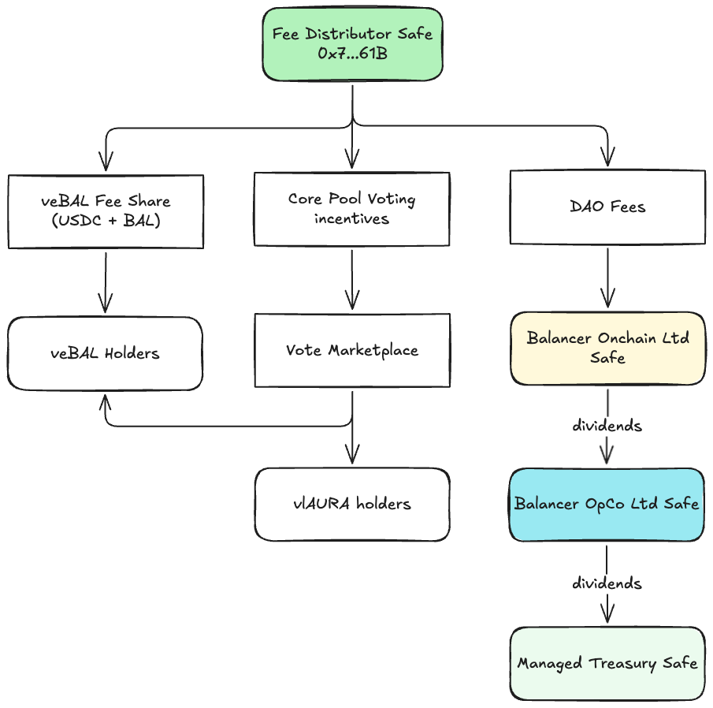

# Protocol Fee Operations

This page describes how protocol fees are collected and processed through Balancer's safe infrastructure. For fee percentages, distribution splits, and core pool requirements, see the [Protocol Fee Model](../protocol-fee-model/protocol-fee-model.md).

## Fee Sources

Protocol fees are collected from the following sources:

### Swap Fees

Balancer collects a percentage of swap fees paid by traders. From the swapper's perspective, there is no price increase—the protocol fee is taken as a fraction of the fee already being collected for liquidity providers.

### Yield Fees

Protocol fees are applied to yield earned by yield-bearing assets with rate providers. The percentage differs between V2 (50%) and V3 (10%), with V3's reduced rate designed to drive adoption of boosted pools technology.

### Flash Loan Fees

[Flash loans](/concepts/vault/flash-loans.md) allow users to borrow assets without collateral, as long as the borrowed amount is repaid within the same transaction. In Balancer V2, governance had the ability to set flash loan fees, but they were always set to zero to encourage developers to build on Balancer. In V3, flash loans operate through the Vault's transient unlock mechanism and remain fee-free by design.

## Fee Collection Infrastructure

Protocol fees are collected differently for Balancer V2 and V3, but both ultimately flow through the Protocol Fees Multisig (also known as the Fee Collector Safe) on Ethereum mainnet for distribution.

### Balancer V3 Collection

V3 fees are swept from pools using burner contracts to the [Omni-sig](./multisig.md) on each chain, then bridged to Ethereum mainnet and transferred to the Protocol Fees Multisig.

### Balancer V2 Collection

V2 fees are processed by [Mimic](https://mimic.fi/) infrastructure, which handles swapping collected tokens to USDC, bridging from L2s to mainnet, and transferring to the Protocol Fees Multisig.

## Fee Distribution Flow

From the Protocol Fees Multisig, fees are distributed according to governance-approved splits (see [Protocol Fee Model](../protocol-fee-model/protocol-fee-model.md) for percentages):

### Distribution Recipients

| Recipient | Description |
|-----------|-------------|
| **veBAL Holders** | Direct USDC payments to veBAL lockers |
| **Core Pool Voting Incentives** | Incentives placed on core pools to drive veBAL votes toward revenue-generating pools |
| **Balancer Onchain Ltd Safe** | DAO's share of protocol revenue |

::: tip Core Pool Status
Interested in having your pool achieve core pool status to benefit from the incentive flywheel? See the [Core Pools guide](../../partner-onboarding/onboarding-overview/core-pools.md) for requirements and application process.
:::

### Corporate Structure Flow

From the Balancer Onchain Ltd Safe, the DAO's share flows up the [corporate structure](./corporate-structure.md):

1. **Balancer Onchain Ltd Safe** receives the DAO portion
2. **Dividends** flow to Balancer OpCo Ltd Safe
3. **Dividends** flow to Treasury Safe for ecosystem reserves

## Governance Controls

### Protocol Fees Multisig

The Protocol Fees Multisig (`0x7c68c42De679ffB0f16216154C996C354cF1161B`) controls fee collection and initial distribution. It operates under the [1/2 operational multisig configuration](./multisig.md#operational-multisigs) with Balancer Onchain Ltd Safe and Operator Safe as signers.

### Fee Parameter Changes

Changes to protocol fee percentages require governance approval through the standard [governance process](./process.md). The DAO Multisig or appropriate chain-specific multisig executes approved changes.

## Related Documentation

- [Protocol Fee Model](../protocol-fee-model/protocol-fee-model.md) - Fee percentages and distribution splits
- [Core Pools](../../partner-onboarding/onboarding-overview/core-pools.md) - Core pool requirements and benefits
- [Multisig](./multisig.md) - Safe infrastructure and signer groups
- [Corporate Structure](./corporate-structure.md) - Legal entity hierarchy
