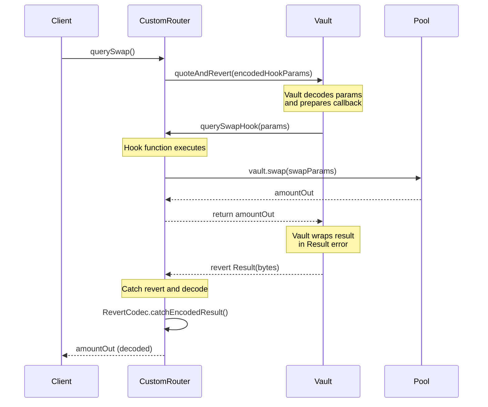

# Querying Swaps Onchain

This guide explains how to query swap operations onchain using Balancer V3's querying mechanisms. You'll learn how to get accurate swap quotes without executing transactions, and how to handle scenarios where you need to query the same pool multiple times without state changes affecting subsequent queries.

## Introduction: quote vs quoteAndRevert

When building applications that interact with Balancer pools, you often need to query swap outcomes before executing them. Balancer V3 provides two methods for querying swap operations: `quote` and `quoteAndRevert`. Understanding the difference between these methods is crucial, especially for scenarios where you need to query the same pool multiple times or compare different swap scenarios.

### quote

The `quote` function performs a callback on `msg.sender` with arguments provided in `data`. It is used to query a set of operations on the Vault. However, `quote` **changes the Vault state** during execution, which means that subsequent queries on the same pool will see the modified state from previous queries.

### quoteAndRevert

The `quoteAndRevert` function is a VaultExtension function that also performs a callback on `msg.sender` with arguments provided in `data`. Unlike `quote`, `quoteAndRevert`:

- **Always reverts** - The call always reverts, returning the result in the revert reason
- **Does not persist state changes** - Since it reverts, any state changes are rolled back
- **Allows multiple queries on the same pool** - You can query the same pool multiple times in its initial state
- **Only works off-chain** - Only off-chain `eth_call` operations are allowed; anything else will revert
- **Non-payable** - The Vault does not allow ETH in these calls

### When to Use quoteAndRevert

Since `quote` changes the Vault state, some query combinations are not possible. For example, if you wanted to quote `querySwapExactIn` for `POOL_A` but also query `querySwapExactOut` for `POOL_A` in its initial state, you would need to use `quoteAndRevert`. In this variant, the call always reverts and returns the result in the revert data (similar to the v2 mechanism).

**Reference Documentation:**
- [Vault API: quoteAndRevert](https://docs.balancer.fi/developer-reference/contracts/vault-api.html#quoteandrevert)
- [Router Queries: quoteAndRevert](https://docs.balancer.fi/concepts/router/queries.html#quoteandrevert)

## Contract Flow and Execution

### Callback Mechanism

When you call `quoteAndRevert` (or `quote`), the Vault performs a callback on `msg.sender` with the arguments provided in `data`. The Vault tries to call `querySwapHook` on your contract (which is the `msg.sender`). If this function doesn't exist, the call will revert. By implementing this function with your desired logic, you can execute the swap query within the hook.

### Execution Flow

The following diagram illustrates the contract flow during `quoteAndRevert` execution:



### Setup Requirements

To use `quoteAndRevert`, you need:

1. **Custom Contract**: You must deploy a separate contract that implements the `querySwapHook` function. This is required because `vault.quote` (and `quoteAndRevert`) performs a callback on `msg.sender` with the encoded function call.

2. **Hook Implementation**: The `querySwapHook` function must:
   - Be marked as `external` (called by the Vault)
   - Accept the hook parameters (typically `IRouter.SwapSingleTokenHookParams`)
   - Perform the actual swap query by calling `vault.swap()`
   - Return the result (which will be encoded in the revert)

3. **Revert Decoding**: You need a mechanism to decode the revert data. The result is wrapped in a `Result(bytes)` error, which needs to be extracted and decoded.

4. **Off-chain Execution**: The call must be made via `eth_call` (static call). For testing with Foundry, you'll need to use `vm.prank(address(0), address(0))` to simulate the off-chain call environment.

**Interface Reference:**
- [IVaultExtension.sol](https://github.com/balancer/balancer-v3-monorepo/blob/main/pkg/interfaces/contracts/vault/IVaultExtension.sol#L440)

## Code Example

The following complete example demonstrates how to use `quoteAndRevert` to query two consecutive swaps on the same pool:

```solidity
// SPDX-License-Identifier: MIT
pragma solidity ^0.8.22;

import "forge-std/Script.sol";
import {console} from "forge-std/console.sol";
import {IRouter} from "@balancer-v3-monorepo/interfaces/vault/IRouter.sol";
import {IVault} from "@balancer-v3-monorepo/interfaces/vault/IVault.sol";
import {IVaultMain} from "@balancer-v3-monorepo/interfaces/vault/IVaultMain.sol";
import {SwapKind, VaultSwapParams} from "@balancer-v3-monorepo/interfaces/vault/VaultTypes.sol";
import {IERC20} from "@openzeppelin/contracts/interfaces/IERC20.sol";
import {IPermit2} from "@permit2/interfaces/IPermit2.sol";

// This has to be deployed as a separate contract because vault.quote performs a callback on msg.sender with the encoded function call
contract CustomRouterQuoteAndRevert {
    IVault public constant vault = IVault(0xbA1333333333a1BA1108E8412f11850A5C319bA9);

    function querySwap() public returns (uint256) {
        console.log("querySwap");
        address pool = 0x85B2b559bC2D21104C4DEFdd6EFcA8A20343361D;
        IERC20 tokenIn = IERC20(0xC71Ea051a5F82c67ADcF634c36FFE6334793D24C);
        IERC20 tokenOut = IERC20(0xD4fa2D31b7968E448877f69A96DE69f5de8cD23E);
        uint256 exactAmountIn = 100000000000000000000;
        bytes memory userData = new bytes(0);
        
        // First swap query
        try vault
            // calls back from vault to querySwapHook
            .quoteAndRevert(
            abi.encodeCall(
                CustomRouterQuoteAndRevert.querySwapHook,
                IRouter.SwapSingleTokenHookParams({
                    sender: msg.sender,
                    kind: SwapKind.EXACT_IN,
                    pool: pool,
                    tokenIn: tokenIn,
                    tokenOut: tokenOut,
                    amountGiven: exactAmountIn,
                    limit: 0,
                    deadline: type(uint256).max,
                    wethIsEth: false,
                    userData: userData
                })
            )
        ) {
            revert("Unexpected success");
        } catch (bytes memory result) {
            uint256 amountOut = abi.decode(RevertCodec.catchEncodedResult(result), (uint256));
            console.log("amountOut 1 (CustomRouterQuoteAndRevert):", amountOut);
        }

        // Second call should not be affected by the first call
        try vault
            // calls back from vault to querySwapHook
            .quoteAndRevert(
            abi.encodeCall(
                CustomRouterQuoteAndRevert.querySwapHook,
                IRouter.SwapSingleTokenHookParams({
                    sender: msg.sender,
                    kind: SwapKind.EXACT_IN,
                    pool: pool,
                    tokenIn: tokenIn,
                    tokenOut: tokenOut,
                    amountGiven: exactAmountIn,
                    limit: 0,
                    deadline: type(uint256).max,
                    wethIsEth: false,
                    userData: userData
                })
            )
        ) {
            revert("Unexpected success");
        } catch (bytes memory result) {
            uint256 amountOut = abi.decode(RevertCodec.catchEncodedResult(result), (uint256));
            console.log("amountOut 2 (CustomRouterQuoteAndRevert):", amountOut);
            return amountOut;
        }
    }

    // this function is called from the vault
    function querySwapHook(IRouter.SwapSingleTokenHookParams calldata params) external returns (uint256) {
        console.log("querySwapHook (CustomRouter)");
        (uint256 amountCalculated, uint256 amountIn, uint256 amountOut) = vault.swap(
            VaultSwapParams({
                kind: params.kind,
                pool: params.pool,
                tokenIn: params.tokenIn,
                tokenOut: params.tokenOut,
                amountGivenRaw: params.amountGiven,
                limitRaw: params.limit,
                userData: params.userData
            })
        );
        return amountOut;
    }
}

contract QuoteAndRevert is Script {
    IVault public constant vault = IVault(0xbA1333333333a1BA1108E8412f11850A5C319bA9);

    function run() public returns (uint256) {
        runQuote();
        //runQuoteAndRevert();
        return 0;
    }

    function runQuoteAndRevert() public returns (uint256) {
        vm.startBroadcast();
        CustomRouterQuoteAndRevert customRouter = new CustomRouterQuoteAndRevert();
        vm.stopBroadcast();

        // Use vm.prank with address(0) for both msg.sender and tx.origin to simulate a static call
        // This is required because vault.quote() checks that tx.origin == address(0)
        vm.prank(address(0), address(0));
        uint256 amountOut = customRouter.querySwap();

        console.log("amountOut:", amountOut);
        return 0;
    }
}

/// @notice Support `quoteAndRevert`: a v2-style query which always reverts, and returns the result in the return data.
library RevertCodec {
    /**
     * @notice On success of the primary operation in a `quoteAndRevert`, this error is thrown with the return data.
     * @param result The result of the query operation
     */
    error Result(bytes result);

    /// @notice Handle the "reverted without a reason" case (i.e., no return data).
    error ErrorSelectorNotFound();

    function catchEncodedResult(bytes memory resultRaw) internal pure returns (bytes memory) {
        bytes4 errorSelector = RevertCodec.parseSelector(resultRaw);
        if (errorSelector != Result.selector) {
            // Bubble up error message if the revert reason is not the expected one.
            RevertCodec.bubbleUpRevert(resultRaw);
        }

        uint256 resultRawLength = resultRaw.length;
        assembly ("memory-safe") {
            resultRaw := add(resultRaw, 0x04) // Slice the sighash
            mstore(resultRaw, sub(resultRawLength, 4)) // Set proper length
        }

        return abi.decode(resultRaw, (bytes));
    }

    /// @dev Returns the first 4 bytes in an array, reverting if the length is < 4.
    function parseSelector(bytes memory callResult) internal pure returns (bytes4 errorSelector) {
        if (callResult.length < 4) {
            revert ErrorSelectorNotFound();
        }
        assembly ("memory-safe") {
            errorSelector := mload(add(callResult, 0x20)) // Load the first 4 bytes from data (skip length offset)
        }
    }

    /// @dev Taken from Openzeppelin's Address.
    function bubbleUpRevert(bytes memory returnData) internal pure {
        // Look for revert reason and bubble it up if present.
        if (returnData.length > 0) {
            // The easiest way to bubble the revert reason is using memory via assembly.

            assembly ("memory-safe") {
                let return_data_size := mload(returnData)
                revert(add(32, returnData), return_data_size)
            }
        } else {
            revert ErrorSelectorNotFound();
        }
    }
}
```

## Code Walkthrough

### querySwap() Function

The `querySwap()` function demonstrates how to make consecutive queries on the same pool:

1. **Encoding Hook Parameters**: The function prepares swap parameters and encodes them using `abi.encodeCall()` to create the callback data:
   ```solidity
   abi.encodeCall(
       CustomRouterQuoteAndRevert.querySwapHook,
       IRouter.SwapSingleTokenHookParams({...})
   )
   ```

2. **Calling quoteAndRevert**: The encoded parameters are passed to `vault.quoteAndRevert()`, which will:
   - Decode the parameters
   - Call back to `querySwapHook` on the contract
   - Wrap the result in a `Result(bytes)` error and revert

3. **Catching and Decoding**: The function uses a `try-catch` block to catch the revert:
   ```solidity
   catch (bytes memory result) {
       uint256 amountOut = abi.decode(RevertCodec.catchEncodedResult(result), (uint256));
   }
   ```

4. **Consecutive Queries**: The function makes two identical queries. Because `quoteAndRevert` reverts (rolling back state), the second query sees the pool in its original state, unaffected by the first query.

### querySwapHook() Function

The `querySwapHook()` function is called by the Vault during `quoteAndRevert` execution:

1. **External Callback**: The function is marked as `external` because it's called by the Vault (not by your contract directly).

2. **Parameter Reception**: It receives `IRouter.SwapSingleTokenHookParams` containing all the swap details (pool, tokens, amounts, etc.).

3. **Swap Execution**: The function calls `vault.swap()` with the provided parameters to perform the actual swap query:
   ```solidity
   (uint256 amountCalculated, uint256 amountIn, uint256 amountOut) = vault.swap(
       VaultSwapParams({...})
   );
   ```

4. **Return Value**: The function returns `amountOut`, which the Vault will encode and include in the revert data.

### RevertCodec Library

The `RevertCodec` library handles decoding the revert data from `quoteAndRevert`:

1. **Result Error**: The library defines a `Result(bytes result)` error type. When `quoteAndRevert` succeeds, the Vault throws this error with the return data encoded.

2. **catchEncodedResult()**: This is the main decoding function:
   - **Parse Selector**: Extracts the first 4 bytes (error selector) to verify it's the `Result` error
   - **Validate**: If the selector doesn't match, it bubbles up the actual revert reason
   - **Slice Data**: Removes the 4-byte selector from the data
   - **Decode**: Decodes the remaining bytes to extract the actual result

3. **parseSelector()**: Extracts the error selector (first 4 bytes) from the revert data using assembly for efficiency.

4. **bubbleUpRevert()**: If the revert wasn't a `Result` error, this function re-throws the original revert reason, allowing proper error propagation.

### Revert Decoding Process

The revert decoding process works as follows:

1. **Vault Reverts**: After executing the hook, the Vault wraps the return value in a `Result(bytes)` error and reverts.

2. **Catch Revert**: Your code catches the revert in a `try-catch` block, receiving the raw bytes.

3. **Extract Selector**: `parseSelector()` reads the first 4 bytes to identify the error type.

4. **Validate**: If it's not a `Result` error, the original revert is re-thrown.

5. **Decode**: If it is a `Result` error, the selector is removed and the remaining bytes are decoded to extract your return value.

### Testing with address(0) Workaround

When testing with Foundry, you need to simulate the off-chain call environment:

```solidity
// Use vm.prank with address(0) for both msg.sender and tx.origin to simulate a static call
// This is required because vault.quote() checks that tx.origin == address(0)
vm.prank(address(0), address(0));
uint256 amountOut = customRouter.querySwap();
```

**Why this is needed:**
- `quoteAndRevert` only works with off-chain `eth_call` operations
- The Vault checks that `tx.origin == address(0)` to ensure it's an off-chain call
- In Foundry tests, `vm.prank(address(0), address(0))` sets both `msg.sender` and `tx.origin` to `address(0)`, simulating the off-chain environment
- Without this, the Vault will revert with: "Only off-chain eth_call are allowed, anything else will revert."

This workaround allows you to test `quoteAndRevert` functionality in a Foundry script environment while maintaining the same behavior as an actual off-chain `eth_call`.
